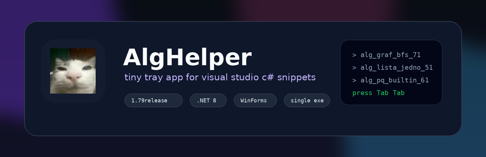
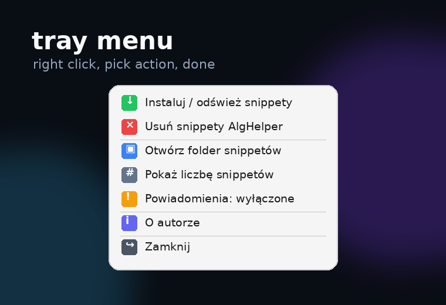

<p align="center">
  
</p>

<h1 align="center">AlgHelper</h1>

<p align="center">
  <b>tiny tray app for Visual Studio C# snippets</b>
</p>

<p align="center">
  
  
  
  
</p>

<p align="center">
  
</p>

---

## preview

<p align="center">
  
</p>

## quick start

```powershell
dotnet publish -c Release -r win-x64 -p:PublishSingleFile=true --self-contained false
```

or:

```bat
build_single_exe.bat
```

output:

```text
bin\Release\net8.0-windows\win-x64\publish\AlgHelper.exe
```

## paths

| name | path |
|---|---|
| snippets folder | `Documents\Visual Studio 2022\Code Snippets\Visual C#\My Code Snippets\AlgHelper` |
| exe output | `bin\Release\net8.0-windows\win-x64\publish\AlgHelper.exe` |

## snippet usage

```text
alg_graf_bfs_71 + Tab + Tab
alg_lista_jedno_51 + Tab + Tab
alg_pq_builtin_61 + Tab + Tab
```

## project structure

```text
AlgHelper/
├─ Program.cs
├─ AlgHelper.csproj
├─ alghelper.ico
├─ Resources/
├─ snippets/
├─ assets/
├─ README.md
├─ LICENSE
├─ .gitignore
├─ build_single_exe.bat
└─ build_single_exe.ps1
```

## tray actions

| action | what it does |
|---|---|
| install / refresh | creates `AlgHelper` snippet folder and writes snippets |
| remove snippets | deletes the whole `AlgHelper` snippet folder |
| open folder | opens the main Visual Studio snippets directory |
| count snippets | shows how many snippets are installed |
| notifications | toggles tray balloons |
| about | shows author info and GitHub link |
| exit | closes app and cleans its snippet folder |

## author

**bearbine**  
<https://github.com/bearbine>

## license

MIT
