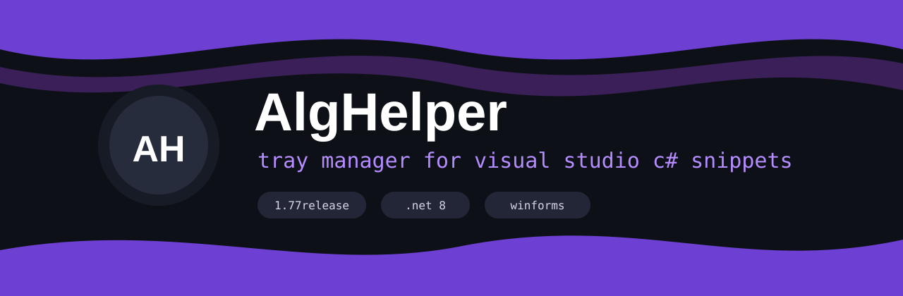
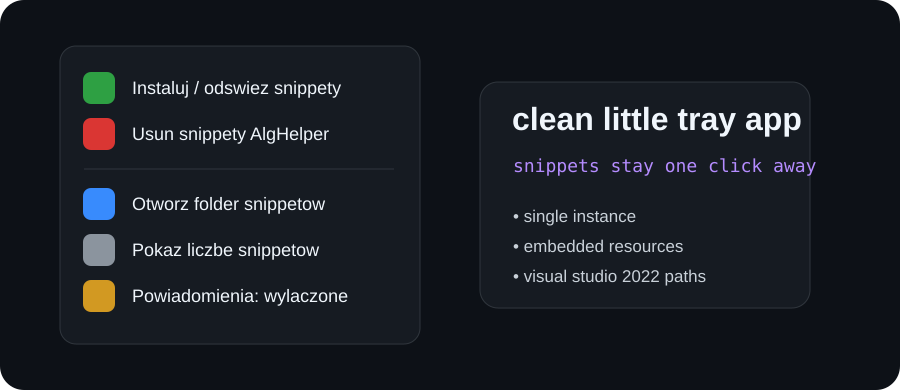

<p align="center">
  
</p>

<p align="center">
  <a href="https://github.com/bearbine/AlgHelper/releases"></a>
  
  
  
</p>

<p align="center">
  <b>small tray manager for Visual Studio C# snippets</b><br>
  install, refresh and remove your prepared algorithm snippets without digging through folders.
</p>

---

## preview

<p align="center">
  
</p>

## why

AlgHelper was made for a simple workflow: keep useful C# snippets ready, but manage them from a clean tray app.

It writes snippets only when you click install, keeps the app single-instance, and can remove its snippet folder when you close it normally.

## features

<table>
<tr>
<td width="50%">

### tray workflow

- install / refresh snippets
- remove the full `AlgHelper` snippet folder
- open the Visual Studio snippets location
- optional notifications
- one-instance lock

</td>
<td width="50%">

### packed release

- single `.exe` after publish
- embedded icons
- embedded author image
- embedded snippet data
- no extra files needed near the exe

</td>
</tr>
</table>

## snippet path

After clicking **Instaluj / odśwież snippety**, the app creates:

```text
Documents\Visual Studio 2022\Code Snippets\Visual C#\My Code Snippets\AlgHelper
```

Inside Visual Studio, use prefixes like:

```text
alg_graf_bfs_71
alg_lista_jedno_51
alg_pq_builtin_61
```

Then press `Tab` twice.

## build

Requirements:

- Windows
- .NET 8 SDK
- Visual Studio 2022, if you want to use the snippets

Build a single-file executable:

```powershell
dotnet publish -c Release -r win-x64 -p:PublishSingleFile=true --self-contained false
```

Or run:

```bat
build_single_exe.bat
```

Output:

```text
bin\Release\net8.0-windows\win-x64\publish\AlgHelper.exe
```

## project structure

```text
AlgHelper/
├─ Program.cs
├─ AlgHelper.csproj
├─ Resources/
├─ snippets/
├─ assets/
├─ README.md
├─ LICENSE
└─ build_single_exe.bat
```

## notes

If the process is killed from Task Manager, Windows may not give the app time to remove the snippet folder. For normal cleanup use:

```text
right click tray icon -> Zamknij
```

or:

```text
right click tray icon -> Usuń snippety AlgHelper
```

## author

**bearbine**  
GitHub: <https://github.com/bearbine>

## license

MIT
